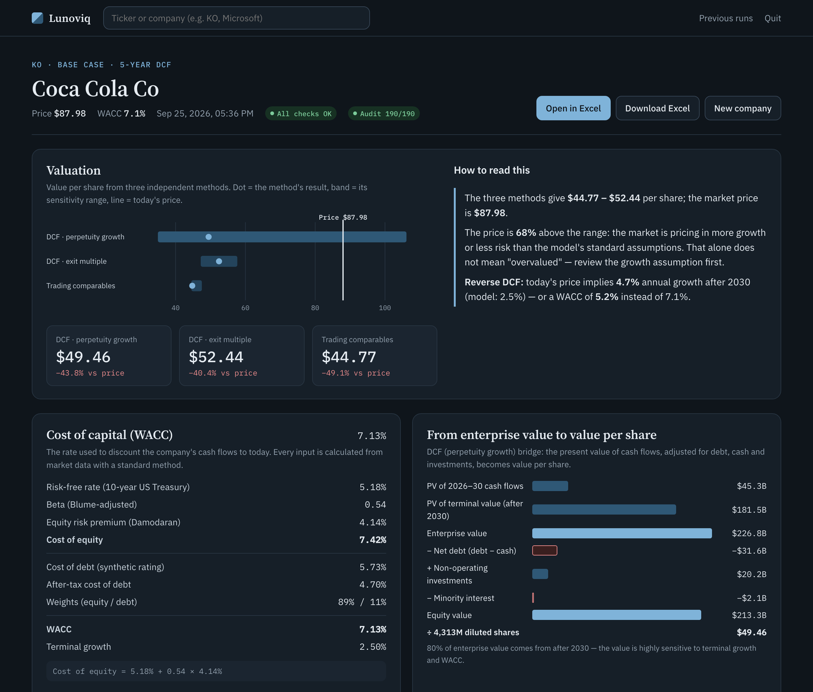

# Lunoviq: Financial Analysis & Valuation Automation

One command turns a stock ticker into a complete, recalculated, auditable
valuation model:

```
python -m lunoviq run KO
```



```
Ticker ─► Data providers ─► Standardized schema ─► Excel model (copy) ─► Recalculation ─► Validation
          SEC EDGAR          DataPoint:             named ranges,          Microsoft Excel    health checks,
          Yahoo prices       value + unit +         formula-protected,     via xlwings        CHECK flags,
          US Treasury/FRED   source + date +        09_Sources audit log                      run.json record
          Damodaran ERP      method + status
          Analyst consensus
```

The Excel model contains a 3-statement model, DCF (perpetuity and exit
multiple), sensitivity tables, trading and transaction comparables, scenarios
(Bear/Base/Bull) and a management dashboard with built-in model-health checks.

**Sister project:** [Lunoviq FP&A](https://github.com/tolgaoy5-cpu/lunoviq-fpa) covers budgeting,
budget vs actual, rolling forecasts and 13-week cash for any company.

**AI valuation memo** (optional). With your own OpenAI or Anthropic API key, the app drafts a short memo for a manager
or an investment committee from the run's figures. The safeguards:
- every $ amount, percentage and multiple is checked against the valuation;
- comparisons (above/below) are worked out by the code, and a draft that states one the wrong way round is rejected;
- a draft that gives a buy/sell/hold recommendation is rejected;
- nothing is sent unless you ask.

## Web app

```bash
python -m lunoviq serve        # or double-click Lunoviq.command (macOS)
python tools/make_mac_app.py   # builds ~/Applications/Lunoviq Valuation.app (icon; starts in the background)
```

The app opens at `http://127.0.0.1:8765`. It runs locally only and uses the Python standard library, so nothing extra needs installing. It provides:
- Company search by ticker or name.
- Live progress while the model is built.
- A results dashboard:
  - value range across the three methods compared with the market price, plus a reverse DCF,
  - how the WACC is built,
  - the enterprise-to-equity bridge,
  - financials chart,
  - WACC × growth sensitivity heatmap,
  - peers and benchmarks,
  - checks and the independent audit,
  - every input's source.
- Revenue growth sources side by side: analyst consensus, company guidance (your
  input) and history, with the one used marked and large gaps flagged.
- Editing the key assumptions (year-1 growth from company guidance, terminal growth,
  exit multiple) and rebuilding.
- Downloading the Excel model, or opening it in Excel.

The interface is in English, with light and dark themes and a phone layout. The app stays running in the background until you choose **Quit** in the top bar.

## What each run produces

`output/<TICKER>_<timestamp>/`
- `<TICKER>_Model.xlsx`: the populated and recalculated model. It includes a
  `09_Sources` sheet listing every input with its source, as-of date, method,
  and status (`auto` / `override` / `template_default`).
- `run.json`: a machine-readable record of all inputs, the normalized financial
  statements, and the model outputs (valuation, WACC, health checks, flags).

## Data sources (free tier)

| Role | Provider | Notes |
|---|---|---|
| Financial statements | SEC EDGAR companyfacts (XBRL) | Official, US filers. Prioritized tag mapping with fiscal-year and duration checks. |
| Share price, beta | Yahoo Finance chart API | Free/unofficial, so for personal use only. Swap for a licensed vendor commercially. |
| Analyst consensus (revenue, next 2 years) | stockanalysis.com forecast page | Free/unofficial, cached for a day. Optional: if it is missing or refers to another fiscal year, growth falls back to history and is flagged. |
| Risk-free rate | US Treasury yield curve, with FRED DGS10 as fallback | 10-year constant maturity |
| Equity risk premium | Damodaran implied ERP (NYU Stern) | Monthly |

Providers implement small interfaces (`lunoviq/providers/base.py`) and are
selected in `config/lunoviq.toml`. Adding a paid vendor means adding one
module; the pipeline and Excel layer do not change.

## Revenue growth

- **Year 1:** your company-guidance input if given, otherwise analyst consensus,
  otherwise the company's own 5-year CAGR (flagged for review).
- **Year 2:** analyst consensus when available.
- **Later years** fade linearly to terminal growth by year 5.
- **Alignment check.** Consensus is only used when its last reported year and
  revenue match the SEC data.
- **Flags.** A year-1 figure more than 10 points from history is flagged
  (acquisitions, divestitures, one-offs), and so is guidance far from consensus.
  In that case consensus year 2 is not used, because it builds on consensus year 1.

```
python -m lunoviq run KDP --set drv_Year1Growth=0.05
```

## Design principles

- **The master template is never modified.** Each run writes to a copy.
- **Formulas are protected.** Inputs are written through named ranges, and
  writing to a cell that holds a formula raises an error.
- **Every number is traceable.** Each value carries its source, date, and
  derivation, both in the workbook and in `run.json`.
- **Judgement stays with the analyst.** Inputs with no objectively correct
  value use a documented standard default and are flagged for review: terminal
  growth is 2.5%, and the exit multiple is the industry EV/EBITDA. Both can be
  overridden in the web app or on the command line:
  ```
  python -m lunoviq run KO --set val_TerminalGrowth=0.02 --set val_ExitMultiple=18
  ```
  Persistent overrides can go in `overrides/<TICKER>.toml` under `[inputs]`.
- **Policies are configuration, not code.** Beta window, credit spread, and tax
  bounds are set in `[wacc]` of the config.

## Setup

```bash
pip install -r requirements.txt
cp config/lunoviq.example.toml config/lunoviq.toml
# edit config/lunoviq.toml -> [sec] user_agent = "YourName your@email"  (SEC requirement)
python -m lunoviq run KO
```

Recalculation requires Microsoft Excel (macOS or Windows). Without it, use
`--no-recalc`: the populated workbook recalculates when opened in Excel.

## Tests

```bash
python -m pytest                     # fast, offline (network sources stubbed)
RUN_EXCEL_TESTS=1 python -m pytest   # adds end-to-end Excel recalculation tests
```

The tests cover:
- Provider parsers.
- WACC components (beta regression, cost-of-debt floor, tax rate, capital weights).
- Named-range writing and formula protection.
- The offline end-to-end pipeline.
- Template integrity: every template version is rebuilt by its script and
  compared with the committed file, and only the intended cells may change.
  (The provenance tests of v2 need the original source workbooks, which are not
  published, and are skipped without them.)

## Repository layout

```
lunoviq/                 package
  providers/             sec_edgar, sec_xbrl (XBRL mapping engine), yahoo, rates,
                         industry (Damodaran), estimates (analyst consensus)
  drivers.py             forecast drivers: consensus/guidance/history growth, working capital, capex
  schema.py              standardized DataPoint / FinancialStatements model
  market_inputs.py       cost-of-capital inputs from market data
  excel/                 writer (named ranges, audit log), recalc (Excel), reader
  pipeline.py            end-to-end orchestration
  audit.py               independent Python re-computation of the forecast vs Excel
  summary.py             run summary for the UI
  web/                   local web app (server.py + static/)
config/                  lunoviq.example.toml (committed), lunoviq.toml (local)
templates/               master Excel templates v1-v7 (the pipeline uses v7)
tools/                   template builders (one XML-level patch per version), workbook
                         inspector/differ, batch check, Mac app builder, edgar_feed CLI
tests/                   pytest suite
data/fixtures/           cached SEC payloads for offline tests
peers/                   optional analyst peer lists (peers/<TICKER>.csv)
docs/                    workbook inventory, change log, screenshot
```

## Status

**Done:**
- Workbook inventory and the merged master template (versions v2 to v7).
- Provider architecture and standard WACC:
  - Blume-adjusted beta,
  - Damodaran synthetic-rating cost of debt,
  - Treasury risk-free rate,
  - Damodaran equity risk premium.
- Data-driven forecast drivers.
- Net income reconciled to reported figures.
- A three-method valuation:
  - DCF by perpetuity growth,
  - DCF by industry exit multiple,
  - trading comparables with automatic or analyst-chosen peers.
- Reverse DCF.
- Independent audit: Python recomputes the whole 5-year forecast and matches Excel.
- Revenue growth from analyst consensus or company guidance, with history as fallback.
- The web app and a double-clickable macOS app.

**Next:** licensed data providers for commercial use, and precedent-transaction data.

See `docs/CHANGELOG.md` for every change and its reasoning.

## Limitations

- US SEC filers only; annual data only. Some companies are unsupported because
  SEC's XBRL data for them is incomplete (for example XOM).
- Yahoo data is unofficial and not for commercial redistribution.
- Apart from revenue growth, forecast drivers (margins, working capital, capex)
  are history-based defaults; they are flagged in `09_Sources` and in the app.
- Analyst consensus includes announced acquisitions, which the model does not
  add to the balance sheet; the app flags such cases (enter guidance instead).
- There is no free source for precedent transactions, so that method shows as n/a.
- Share buybacks are not modelled, so forecast cash builds up.
- Recalculation needs Microsoft Excel for Mac (via xlwings). Workbooks are
  recalculated on a copy inside Excel's sandbox folder; if Excel stops responding
  (for example because a dialog is open), the run stops after 180 s with a clear message.

## License

Copyright (c) 2026 Tolga Oy. All rights reserved. The code is published for
viewing only; see [LICENSE](LICENSE). Data from SEC EDGAR is public; Yahoo,
Damodaran and stockanalysis.com data are subject to their own terms.
